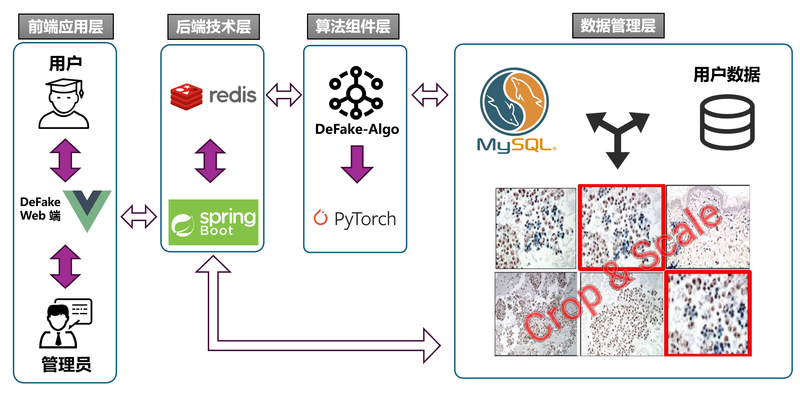
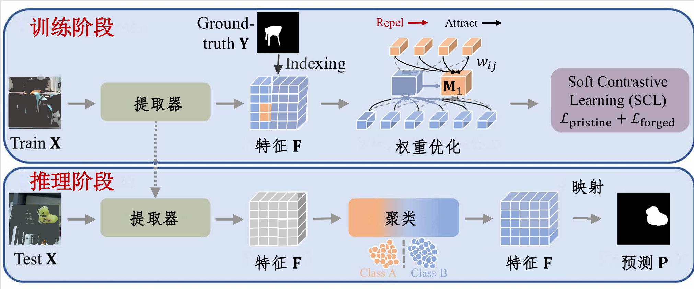
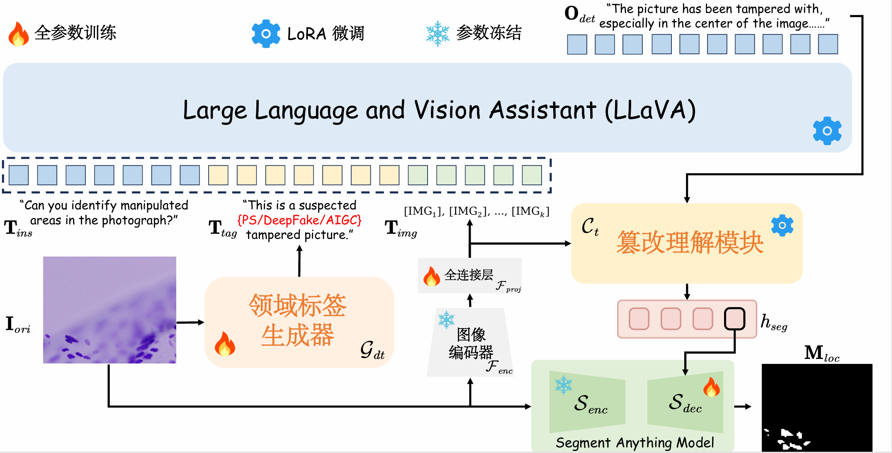

# DeFake Algo

### 🏆Overview

本仓库为 DeFake 项目算法端，实现了基于多模态大模型、深度学习、传统 CV 处理的检测算法。 



#### Traditional Method Detection

The following algorithms are supported:

* sift_dbscan_detect
* metadata_analysis
* noise_variance_inconsistency
* copy_move_detect
* ela_analysis
* jpeg_compression

#### FOrensic ContrAstive cLustering (FOCAL)



#### FakeShield




### 🛠️ 环境配置

以下均在 Linux 服务器下配置，系统版本 Ubuntu 22.04

```bash
cd traditional_method_detection
pip install -r requirements.txt
```

需要手动安装 `mmcv`：

```bash
git clone https://github.com/open-mmlab/mmcv
cd mmcv
git checkout v1.7.2 # 需要根据 torch、cuda 版本进行选择，我们使用的是 v1.7.2
MMCV_WITH_OPS=1 pip install -e .
```

安装 `DTE-FDM`

```bash
cd FakeShield/DTE-FDM
pip install -e .
pip install -e ".[train]"
```


### 🤖 下载模型权重

#### FOCAL

预训练模型可以从[Google Drive](https://drive.google.com/drive/folders/12ayIO9PU4wvqWqniT3KtH8tCvrZ-M-zd)下载。

请将你的 `weight/` 文件夹整理如下结构：
```
 focal/
 ├── weight/
 │   ├── FOCAL_HRNet_weights.pth
 │   ├── FOCAL_ViT_weights.pth
```

#### FakeShield

1. **从 Hugging Face 下载 FakeShield 权重**
   
   模型权重由三个部分组成：`DTE-FDM`、`MFLM` 和 `DTG`。

   我们推荐使用镜像网站 `hf-mirror.com` 的 huggingface 专用下载工具来下载权重：
   
    **下载 hfd**
   ```bash
   wget https://hf-mirror.com/hfd/hfd.sh
   chmod a+x hfd.sh
   ```
   
   **设置环境变量**
   
   ```bash
   export HF_ENDPOINT=https://hf-mirror.com
   ```
   
   **下载模型**
   
   ```bash
   ./hfd.sh zhipeixu/fakeshield-v1-22b
   ```
   
2. **下载预训练的 SAM 权重**
   
   在 MFLM 中，我们将使用 SAM 的预训练权重。你可以使用 `wget` 来下载 `sam_vit_h_4b8939.pth` 模型文件：
   ```bash
   wget https://huggingface.co/ybelkada/segment-anything/resolve/main/checkpoints/sam_vit_h_4b8939.pth -P weight/
   ```

3. **确保权重文件放置正确**
   
   请将你的 `weight/` 文件夹整理如下结构：
   ```
    FakeShield/
    ├── weight/
    │   ├── fakeshield-v1-22b/
    │   │   ├── DTE-FDM/
    │   │   ├── MFLM/
    │   │   ├── DTG.pth
    │   ├── sam_vit_h_4b8939.pth
   ```

4. **注意**

   FakeShield 大模型推理对显存要求较高，大约为 **20-30 G**，GPU 推荐使用 NVIDIA H100/A100，我们使用的为 NVIDIA A100 PCIe 80 GB.

   Debug 调试信息可以查看 `FakeShield/scripts/error.txt`

### 🚀快速开始

直接运行 `detect.py` 文件即可：

```bash
conda activate defake
python detect.py
```


### 🙏 致谢

我们感谢《软件工程》课程组老师和助教的耐心指导，感谢 LLaVA、groundingLMM 和 LISA 开源发布了他们的模型和代码。
